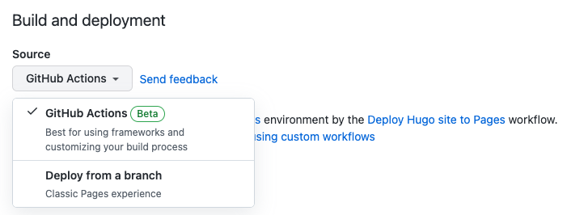

# hugo-PaperModX Example

This repository offers an example site for [hugo-PaperModX](https://github.com/reorx/hugo-PaperModX)

The GitHub Pages site for this repo is at: https://reorx.github.io/papermodx-example/

## How to use

1. Fork this repo
2. Go to "Settings > Pages", select "GitHub Actions" for the "Source" dropdown

    
3. Go to "Actions", rerun the failed workflow
4. Your site should be available at `https://$USERNAME.github.io/papermodx-example/`, you can also check the URL at `https://github.com/$USERNAME/papermodx-example/settings/pages`
